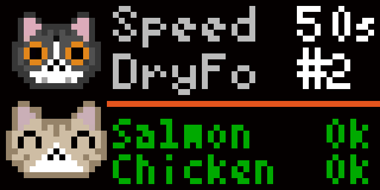
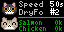

# 🐈 PETKIT Cat Food Stats for Tidbyt / [Tronbyt Server](https://github.com/tronbyt/
⚠️ Recommended way: Use the script/automation via HomeAssistant with [TidbytAssistant](https://github.com/savdagod/TidbytAssistant) for automations.

😺 Needs this awesome HACS Integration to work: [home-assistant-petkit](https://github.com/RobertD502/home-assistant-petkit) 
    Optional: Setup Helper Entity in HA for better usage

This Pixlet applet shows recent usage statistics from your automatic feeder (e.g. Fresh Element Gemini):

- ℹ️ Choose Device Name
- ⏲️ Choose Informations to Show
- 🖌️ Choose Cat Pixel Art
- 😺 Upload Custom Pixel Art for Your Cats

## Preview

 

## 🐱 Available Cat Pixel Art

| 0 | 1 | 2 | 3 | 4 | 5 | 6 | 7 | 8 | 9 | 10 | 11 |
|---|---|---|---|---|---|---|---|---|---|---|----|
|  |  |  |  |  |  |  |  |  |  |  |  |

## 1. Setup [home-assistant-petkit](https://github.com/RobertD502/home-assistant-petkit) from HACS and follow the instructions
Install HACS on your HA Instance. Install Petkit HACS. Follow Setup Instructions there.

## Optional: Setup Helper Entity in HA for better usage
Setup a new Helper Entity -> Input Daytime -> create: E.g. `input_datetime.letztes_nassfutter`

## Home Assistant as Host 
## 2. Setup [TidbytAssistant](https://github.com/savdagod/TidbytAssistant) from HACS
--> Easy way to send custom .star to yout Tidbyt Device locally. Install TidbytAssistan HACS. Follow Setup Instructions there. 
## 3. Setup Script in HA to run cat_food_stats.star (YAML)
Exampe Scipt
```yaml
sequence:
  - action: tidbytassistant.push
    metadata: {}
    data:
      contenttype: custom
      publishtype: foreground
      language: de
      customcontent: cat_food_stats/cat_food_stats.star     <-----(here: root/tidbyt/cat_food_stats/cat_food_stats.star)
      devicename:
        - tidbyt
      arguments: >-
        server_address_input=-->PUT YOUR HA SERVER HERE<--/;server_api_key=-->PUT YOUR HA API KEY HERE<--;lang=de;entity_feeder_name=trockenfutter;top_info_line=time_wet;entity_last_wetfood_helper_name=letztes_nassfutter;number_of_hopper=2;food_type_order=Chicken,
        Salmon;cat_0_art=0;cat_1_art=1
alias: Cat_Food_Stats_Tidbyt
description: "Show Cat Food Stats on Tidbyt Screen."
```
Most Important here ist the `arguments:` field. Setup the values as needed. 

⚠️ Important: when using the GUI of Tidbyt Push Script setup, put all values in one line!

```yaml
arguments: >-
        server_address_input=-->PUT YOUR HA SERVER HERE<--/;server_api_key=-->PUT YOUR HA API KEY HERE<--;lang=de;entity_feeder_name=trockenfutter;top_info_line=time_wet;entity_last_wetfood_helper_name=letztes_nassfutter;number_of_hopper=2;food_type_order=Chicken,
        Salmon;cat_0_art=0;cat_1_art=1
```
## Arguments
| Field | Description | Example |
|------|------------|---------|
| **Language** | Display language of the app | `EN`, `DE` |
| **HA Server Address** | Base URL of your Home Assistant instance | `http://homeassistant.local:8123` |
| **API Token** | Long-Lived Home Assistant Access Token | `eyJ0eXAiOiJKV1Qi...` |
| **Entity Cat Feeder HA** | Name of the cat feeder device in Home Assistant (Petkit integration) | `trockenfutter` |
| **Top Information** | Select which statistic is shown at the top of the display (Average Eating Time/Last Wetfood Time (HA Helper requierd)/Battery Status (only if installed)) | `time_avg `, `time_wet `,`battery ` |
| **Entity Last Wetfood Helper HA (optional)** | `input_datetime` helper entity for last wet food time | `input_datetime.letztes_nassfutter` |
| **Number of Hopper** | Number of food hoppers installed in the feeder | `2` |
| **Food Types in Hopper** | Order of food types per hopper (List) | `Chicken, Salmon` |
| **First Cat Pixel Art** | Pixel art style for the first cat (Custom/Style 1/.../11) | `custom`,`0`,`1`...`11` |
| **Second Cat Pixel Art** | Pixel art style for the second cat (Custom/Style 1/.../11) | `custom`,`0`,`1`...`11` |
| **First Cat Custom Art** | Base64-encoded PNG (20×16 px), used when “custom” is selected | `iVBORw0KGgoAAAANSUhEUgAA...` |
| **Second Cat Custom Art** | Base64-encoded PNG (20×16 px), used when “custom” is selected | `iVBORw0KGgoAAAANSUhEUgAA...` |

### Notes
- Fields marked as **optional** can be left empty.
- Numeric values are entered as text and parsed internally.
- Custom pixel art overrides built-in art when selected.
- JSON fields must use valid JSON syntax.
  
## 4. Setup Automation in HA to trigger Display (YAML)
This exmaple automation wakes up and brightens the Tidbyt device up for 15 seconds, then runs the script and turns auto dim on and brightness down. 
```YAML
alias: Catfood Stats
description: "Trigger Cat Food Stats on Tidbyt Screen."
triggers:
  - trigger: state
    entity_id:
      - sensor.trockenfutter_times_dispensed
      - input_datetime.letztes_nassfutter     <----- Optional trigger, when Helper is set up
    attribute: timestamp
conditions:
  - condition: state
    entity_id: input_boolean.stumm
    state:
      - "off"
actions:
  - action: switch.turn_off
    metadata: {}
    data: {}
    target:
      entity_id: switch.tidbyte_xxxxxxx_autodim     <----- Put name of Tidbyt Device here
    enabled: true
  - action: light.turn_on
    metadata: {}
    data:
      brightness_pct: 100
    target:
      entity_id: light.tidbyte_xxxxxxx_brightness     <----- Put name of Tidbyt Device here
  - action: script.katzenfutter_stats
    metadata: {}
    data: {}
  - delay:
      hours: 0
      minutes: 0
      seconds: 10
  - action: switch.turn_on
    metadata: {}
    data: {}
    target:
      entity_id: switch.tidbyte_xxxxxxx_autodim     <----- Put name of Tidbyt Device here
    enabled: true
  - action: light.turn_on
    metadata: {}
    data:
      brightness_pct: 55
    target:
      entity_id: light.tidbyte_xxxxxxx_brightness     <----- Put name of Tidbyt Device here
mode: single
```

## Tronbyt as Host
In Tronbyt you should be able to use the Configuration Scheme given in the app for setup of all arguments!
